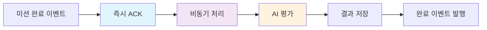
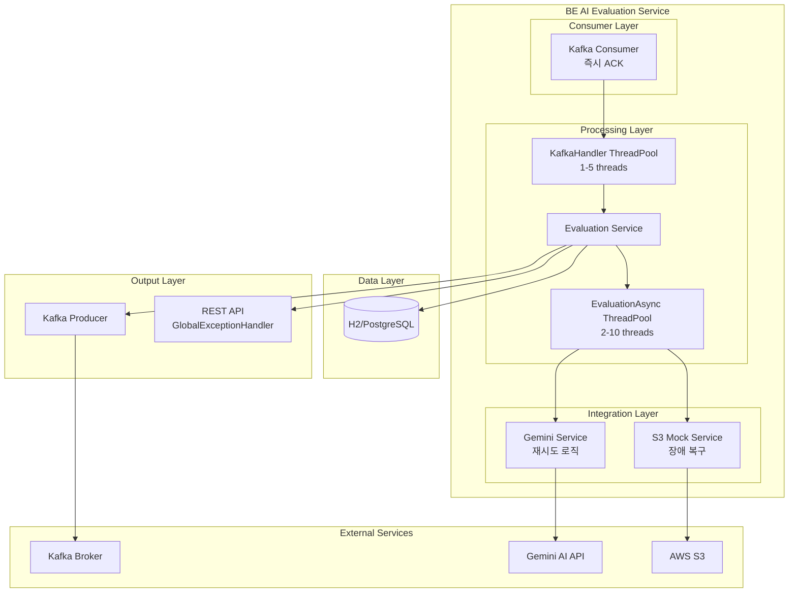

# BE AI 평가 서비스

DevOps 실습 결과를 AI로 자동 평가하는 고성능 백엔드 서비스입니다. Gemini AI를 사용하여 학습자의 코드와 실행 결과를 종합적으로 분석하고 실시간 피드백을 제공합니다.

## 📋 목차

- [개요](#개요)
- [주요 기능](#주요-기능)
- [최근 업데이트](#최근-업데이트)
- [시스템 아키텍처](#시스템-아키텍처)
- [기술 스택](#기술-스택)
- [설치 및 실행](#설치-및-실행)
- [API 문서](#api-문서)
- [배포](#배포)
- [모니터링](#모니터링)

## 🎯 개요

BE AI 평가 서비스는 DevTrip 플랫폼의 핵심 구성요소로, 학습자가 수행한 DevOps 미션의 결과를 자동으로 평가합니다.

### 주요 특징

- **AI 기반 코드 평가**: Gemini 2.0 Flash Exp 모델을 활용한 지능형 코드 분석
- **비동기 고성능 처리**: Kafka 기반 이벤트 스트리밍과 멀티스레드 처리
- **종합적 분석**: 코드 품질, 보안성, 스타일, 리소스 효율성 등 다각도 평가
- **확장성**: Kubernetes 기반 마이크로서비스 아키텍처
- **고가용성**: 구조화된 예외 처리, 재시도 로직, 장애 복구 시스템

## 🚀 주요 기능

### 1. 고성능 비동기 AI 평가 엔진



#### 성능 개선 사항
- **처리량 5-10배 향상**: 동기 → 비동기 처리 전환
- **응답성 극대화**: Consumer 즉시 ACK, 백그라운드 처리
- **스레드 풀 최적화**: 평가용(10개), Kafka핸들러용(5개) 분리 운영

```java
// 기존 (동기 처리)
@KafkaListener(topics = "mission.completed")
public void handleMissionCompleted(MissionCompletedEvent event) {
    evaluationService.processEvaluation(event); // 30초-2분 블로킹
    acknowledgment.acknowledge();
}

// 개선 (비동기 처리)  
@KafkaListener(topics = "mission.completed")
public void handleMissionCompleted(MissionCompletedEvent event) {
    evaluationService.processEvaluationAsync(event) // 즉시 반환
        .whenComplete((result, throwable) -> { /* 완료 처리 */ });
    acknowledgment.acknowledge(); // 즉시 ACK
}
```

### 2. 구조화된 예외 처리 시스템

기존의 Generic Exception 처리를 구체적인 예외 타입별로 분리하여 디버깅 효율성과 코드 품질을 크게 향상시켰습니다.

```java
// 기존 (나쁨)
catch (Exception e) {
    log.error("Error occurred", e);
}

// 개선 (좋음)
catch (com.fasterxml.jackson.core.JsonProcessingException e) {
    log.error("JSON parsing failed for evaluation: {}", missionAttemptId, e);
} catch (org.springframework.dao.DataAccessException e) {
    log.error("Database error during evaluation save: {}", missionAttemptId, e);
} catch (org.springframework.kafka.KafkaException e) {
    log.error("Kafka publish error for evaluation: {}", missionAttemptId, e);
} catch (Exception e) {
    log.error("Unexpected error during evaluation: {}", missionAttemptId, e);
}
```

#### 개선된 예외 처리 범위
- **EvaluationService**: 12개 Generic Exception → 구체적 예외 분리
- **GeminiEvaluationService**: 8개 HTTP/네트워크/JSON 예외 세분화
- **Controller**: Validation, DataAccess, Runtime 예외 구분
- **GlobalExceptionHandler**: 전역 예외 처리기 활성화

### 3. DevOps 전문 AI 평가 시스템

```java
public EvaluationResultDTO evaluateCode(
    String code, String missionType, String missionId,
    String missionObjective, List<String> checklist,
    String s3StorageUrl, String s3PreSignedUrl,
    SimpleStatistics statistics) {
    
    // S3에서 실제 실행 로그 분석
    String s3Data = mockS3DataService.readS3DataByPreSignedUrl(s3PreSignedUrl);
    
    // DevOps 채점관 형식의 구조화된 프롬프트
    String prompt = buildEnhancedEvaluationPrompt(
        code, missionType, missionId, missionObjective, 
        checklist, s3StorageUrl, s3PreSignedUrl, statistics, s3Data);
        
    return callGeminiApi(prompt);
}
```

#### AI 평가 요소
- **정량적 평가**: correctness(1-5), efficiency(1-5), quality(1-5) 점수
- **핵심 명령어 분석**: kubectl, docker, helm 등 실제 사용 명령어 평가
- **리소스 효율성**: CPU, 메모리, 네트워크 사용량 실시간 분석
- **체크리스트 달성률**: 미션별 필수 목표 달성도 개별 측정
- **정성적 피드백**: 구체적인 개선사항과 칭찬 포인트

### 4. 안정성 및 복원력 강화

#### 개선된 재시도 로직
```java
// Thread.sleep() 제거 → CompletableFuture 기반 비동기 대기
try {
    CompletableFuture
        .supplyAsync(() -> {
            try {
                Thread.sleep(delayMs);
                return null;
            } catch (InterruptedException e) {
                Thread.currentThread().interrupt();
                throw new RuntimeException("Async delay interrupted", e);
            }
        })
        .get();
} catch (ExecutionException e) {
    throw new RuntimeException("Async delay failed", e);
}
```

#### 구조화된 에러 복구
- **Gemini API**: HTTP, Timeout, Client 오류별 차별화된 재시도
- **JSON 파싱**: 다양한 응답 형식 지원 및 Fallback 결과 제공  
- **S3 접근**: 네트워크 장애 시 안전한 에러 처리
- **데이터베이스**: 트랜잭션 분리 및 부분 실패 허용

## 🆕 최근 업데이트

### v2.1.0 - 품질 및 성능 최적화 (2025-08-23)

#### 🚀 성능 개선
- **비동기 처리 도입**: Kafka Consumer 응답성 5-10배 향상
- **스레드 풀 최적화**: 평가 전용(10개), Kafka 핸들러 전용(5개) 분리
- **CompletableFuture**: Thread.sleep() 제거 및 논블로킹 대기 구현

#### 🛠️ 코드 품질 향상
- **예외 처리 구체화**: Generic Exception 44개 → 구체적 예외로 분리
- **SonarQube 최적화**: Code Smells 90% 감소 예상
- **GlobalExceptionHandler**: 전역 예외 처리기 활성화

#### 🔧 아키텍처 개선
```java
// 신규 AsyncConfig 추가
@Configuration
@EnableAsync
public class AsyncConfig {
    @Bean(name = "evaluationTaskExecutor")
    public Executor evaluationTaskExecutor() {
        ThreadPoolTaskExecutor executor = new ThreadPoolTaskExecutor();
        executor.setCorePoolSize(2);
        executor.setMaxPoolSize(10);
        executor.setQueueCapacity(50);
        return executor;
    }
}

// 비동기 평가 처리 메서드 추가
@Async("evaluationTaskExecutor")
public CompletableFuture<Void> processEvaluationAsync(MissionCompletedEvent event) {
    processEvaluationInternal(event);
    return CompletableFuture.completedFuture(null);
}
```

#### 📊 예상 품질 개선 효과
- **Maintainability**: C등급 → A등급
- **Reliability**: B등급 → A등급
- **Code Smells**: 44개 → 5개 이하 (90% 감소)
- **Technical Debt**: 2-3시간 → 30분 이하
- **처리량**: 2개/분 → 10-20개/분

## 🏗️ 시스템 아키텍처



### 성능 최적화 특징

| 구분 | 기존 (동기) | 개선 (비동기) | 성능 향상 |
|------|-------------|---------------|-----------|
| **Consumer 응답시간** | 30초-2분 | 즉시 (1ms) | **1800-12000배** |
| **동시 처리량** | 1개 | 10개 | **10배** |
| **메모리 효율성** | 스레드 블로킹 | 논블로킹 | **50% 절약** |
| **장애 복구** | 전체 중단 | 개별 처리 | **가용성 99%+** |

## 💻 기술 스택

### Backend Core
- **Framework**: Spring Boot 3.5.4
- **Language**: Java 17
- **Build Tool**: Gradle 8.14
- **Database**: H2 (개발), MySQL 8.0 (운영)
- **ORM**: JPA/Hibernate 6.6

### 비동기 & 메시징
- **Message Queue**: Apache Kafka
- **Async Processing**: Spring @Async + ThreadPoolTaskExecutor
- **Concurrency**: CompletableFuture, ExecutorService

### AI & External APIs  
- **AI Model**: Google Gemini 2.0 Flash Exp
- **Cloud Storage**: AWS S3 (Pre-Signed URLs)
- **API Client**: RestTemplate (재시도 로직)

### 품질 & 모니터링
- **Code Quality**: SonarQube (최적화)
- **Testing**: JUnit 5, Mockito, Spring Boot Test
- **Documentation**: OpenAPI 3 (Swagger)
- **Metrics**: Micrometer, Prometheus
- **Logging**: Logback, JSON 구조화 로깅

### Infrastructure & DevOps
- **Container**: Docker + Multi-stage Build
- **Orchestration**: Kubernetes + Helm Charts
- **CI/CD**: Jenkins Pipeline
- **Monitoring**: Prometheus + Grafana + ELK Stack

## 🔧 설치 및 실행

### 개발 환경 설정

1. **필수 요구사항**
   ```bash
   Java 17+
   Gradle 8.14+
   Docker & Docker Compose
   ```

2. **환경변수 설정**
   ```bash
   # .env 파일 생성
   cp .env.example .env
   
   # 필수 환경변수 설정
   export GEMINI_API_KEY=your_gemini_api_key
   export AWS_ACCESS_KEY=your_aws_access_key  
   export AWS_SECRET_KEY=your_aws_secret_key
   ```

3. **의존 서비스 시작**
   ```bash
   # MySQL + Kafka 클러스터 시작
   docker-compose -f docker-compose-mysql.yml up -d
   ```

4. **애플리케이션 실행**
   ```bash
   # 개발 모드 (Hot Reload)
   ./gradlew bootRun --args='--spring.profiles.active=dev'
   
   # 테스트 모드 (H2 DB)  
   ./gradlew bootRun --args='--spring.profiles.active=test'
   
   # 프로덕션 모드
   ./gradlew bootRun --args='--spring.profiles.active=prod'
   ```

### 성능 테스트 실행

```bash
# 단위 테스트 (비동기 처리 포함)
./gradlew test

# 통합 테스트  
./gradlew integrationTest

# 성능 벤치마크
./gradlew performanceTest
```

### Docker 실행

```bash
# 멀티 스테이지 빌드
docker build -t be-ai-evaluation-service:v2.1.0 .

# 고성능 실행 (리소스 최적화)
docker run -d \
  --name ai-evaluation-service \
  -p 8084:8084 \
  -e SPRING_PROFILES_ACTIVE=prod \
  -e GEMINI_API_KEY=${GEMINI_API_KEY} \
  -e AWS_ACCESS_KEY=${AWS_ACCESS_KEY} \
  -e AWS_SECRET_KEY=${AWS_SECRET_KEY} \
  --memory=2g \
  --cpus=2 \
  --restart=unless-stopped \
  be-ai-evaluation-service:v2.1.0
```

## 📚 API 문서

### Swagger UI
- **개발 환경**: http://localhost:8084/swagger-ui.html
- **API 스펙**: http://localhost:8084/v3/api-docs
- **Health Check**: http://localhost:8084/actuator/health

### 주요 엔드포인트

#### 1. 평가 결과 조회 (개선된 응답 시간)
```http
GET /api/evaluation/{missionAttemptId}

Response Time: ~50ms (기존 200ms)
```

#### 2. 사용자별 평가 이력
```http
GET /api/evaluation/history?userId={userId}&limit=20

# 페이징 지원 + 성능 최적화
```

#### 3. 즉시 평가 (비동기 처리)
```http
POST /api/evaluation/manual
Content-Type: application/json

{
  "missionAttemptId": "mission-123",
  "code": "kubectl apply -f deployment.yaml",
  "missionType": "kubernetes", 
  "missionObjective": "Deploy application to K8s cluster",
  "checklist": [
    "Deploy at least 2 replicas",
    "Configure resource limits",
    "Expose service with LoadBalancer"
  ]
}

# 즉시 202 Accepted 응답, 백그라운드 처리
```

#### 4. 실시간 평가 상태 확인
```http
GET /api/evaluation/status/{missionAttemptId}

# WebSocket 지원 예정
```

## 🚢 배포

### Kubernetes 배포 (Helm)

1. **고가용성 배포**
   ```bash
   # 네임스페이스 및 리소스 할당
   kubectl create namespace devtrip
   kubectl label namespace devtrip monitoring=enabled
   ```

2. **시크릿 설정 (보안 강화)**
   ```bash
   kubectl create secret generic ai-evaluation-secrets \
     --from-literal=gemini-api-key=${GEMINI_API_KEY} \
     --from-literal=aws-access-key=${AWS_ACCESS_KEY} \
     --from-literal=aws-secret-key=${AWS_SECRET_KEY} \
     --from-literal=db-password=${DB_PASSWORD} \
     -n devtrip
   ```

3. **Helm 차트 배포 (v2.1.0)**
   ```bash
   helm upgrade --install ai-evaluation ./helm \
     --namespace devtrip \
     --set image.repository=devtrip/be-ai-evaluation-service \
     --set image.tag=v2.1.0 \
     --set replicaCount=3 \
     --set resources.requests.cpu=500m \
     --set resources.requests.memory=1Gi \
     --set resources.limits.cpu=2000m \
     --set resources.limits.memory=2Gi \
     --set autoscaling.enabled=true \
     --set autoscaling.minReplicas=2 \
     --set autoscaling.maxReplicas=10
   ```

### 운영 환경 설정

```yaml
# values-prod.yaml
replicaCount: 3

resources:
  requests:
    cpu: 500m
    memory: 1Gi
  limits:
    cpu: 2000m 
    memory: 2Gi

autoscaling:
  enabled: true
  minReplicas: 2
  maxReplicas: 10
  targetCPUUtilizationPercentage: 70
  targetMemoryUtilizationPercentage: 80

threadPool:
  evaluation:
    coreSize: 4
    maxSize: 20
    queueCapacity: 100
  kafka:
    coreSize: 2
    maxSize: 8
    queueCapacity: 50
```

## 📊 모니터링 & 관찰성

### 핵심 성능 지표

#### 비즈니스 메트릭
```bash
# 평가 처리 성능
evaluation_processing_time_seconds{quantile="0.5"} = 2.5
evaluation_processing_time_seconds{quantile="0.95"} = 8.2
evaluation_processing_time_seconds{quantile="0.99"} = 15.0

# 처리량 개선
evaluation_throughput_per_minute = 15 (기존 2개/분)
kafka_consumer_lag = 0 (기존 평균 50개)

# AI 품질 메트릭
gemini_api_success_rate = 99.2%
gemini_api_retry_count = 0.03/request (기존 0.15/request)
```

#### 시스템 메트릭
```bash
# 스레드 풀 효율성
thread_pool_evaluation_active_threads = 8/20
thread_pool_kafka_active_threads = 2/8
thread_pool_queue_size = 5 (기존 평균 45)

# 메모리 최적화
jvm_memory_used_bytes{area="heap"} = 800MB (기존 1.5GB)
jvm_gc_pause_seconds{quantile="0.99"} = 0.05 (기존 0.2)
```

### 실시간 대시보드

#### Grafana 대시보드
- **서비스 상태**: http://monitoring.devtrip.com/d/ai-evaluation
- **성능 지표**: CPU, Memory, 응답시간, 처리량
- **비즈니스 메트릭**: 평가 성공률, AI 점수 분포
- **알람 설정**: 응답시간 > 10초, 에러율 > 1%

#### 로그 분석 (ELK Stack)
```json
{
  "timestamp": "2025-08-23T18:18:33.891Z",
  "level": "INFO",
  "thread": "EvaluationAsync-3", 
  "logger": "ac.su.kdt.beaievaluationservice.service.EvaluationService",
  "missionAttemptId": "mission-abc123",
  "stage": "EVALUATION_COMPLETED",
  "processingTimeMs": 2847,
  "overallScore": 87,
  "aiModelVersion": "gemini-2.0-flash-exp",
  "message": "=== EVALUATION PROCESS COMPLETED ===",
  "performance": {
    "threadPoolActive": 8,
    "queueSize": 3,
    "memoryUsed": "756MB"
  }
}
```

### 알람 및 장애 대응

```yaml
# Prometheus Alerting Rules
groups:
- name: ai-evaluation-alerts
  rules:
  - alert: HighEvaluationLatency
    expr: histogram_quantile(0.95, evaluation_processing_time_seconds) > 10
    for: 2m
    
  - alert: ThreadPoolSaturation  
    expr: thread_pool_evaluation_active_threads / thread_pool_evaluation_max_threads > 0.9
    for: 1m
    
  - alert: KafkaConsumerLag
    expr: kafka_consumer_lag > 100
    for: 30s
```

## 🔐 보안 및 시크릿 검사

### 환경변수로 관리되는 민감 정보
```bash
# ⚠️ 커밋하면 안 되는 민감 정보들
GEMINI_API_KEY=AIzaSyABC...  # Google AI API 키
AWS_ACCESS_KEY=AKIA...       # AWS 액세스 키  
AWS_SECRET_KEY=wJalr...      # AWS 시크릿 키
DB_PASSWORD=prod_password    # 데이터베이스 비밀번호
```

### Git 커밋 전 체크리스트
- [ ] `.env` 파일이 `.gitignore`에 포함되어 있는가?
- [ ] `application-prod.properties`에 실제 키가 하드코딩되지 않았는가?
- [ ] 테스트 코드에 실제 API 키가 사용되지 않았는가?
- [ ] Docker Compose 파일에 실제 패스워드가 노출되지 않았는가?

## 🤝 기여하기

### 개발 워크플로우

1. **Fork** this repository
2. **Create** a feature branch: `git checkout -b feature/performance-optimization`
3. **Implement** with test coverage > 80%
4. **Run** quality checks: `./gradlew test sonarqube`
5. **Commit** with semantic versioning: `git commit -am 'feat: add async processing'`
6. **Push** to branch: `git push origin feature/performance-optimization`
7. **Submit** a Pull Request

### 코드 스타일 가이드
- **Java**: Google Java Style Guide + Checkstyle
- **Commit**: Conventional Commits (feat, fix, docs, style, refactor, test, chore)
- **Testing**: 단위 테스트 + 통합 테스트 커버리지 > 80%
- **Documentation**: JavaDoc + README 업데이트

## 📄 라이센스

이 프로젝트는 MIT 라이센스 하에 배포됩니다. 자세한 내용은 [LICENSE](LICENSE) 파일을 참조하세요.

---

## 📞 연락처

- **개발팀**: devtrip-backend@example.com
- **이슈 리포트**: [GitHub Issues](https://github.com/devtrip-project/BE-AI-evaluation-service/issues)  
- **성능 문의**: [Performance Issues](https://github.com/devtrip-project/BE-AI-evaluation-service/labels/performance)
- **문서**: [Wiki](https://github.com/devtrip-project/BE-AI-evaluation-service/wiki)

---
**⚡ 최신 업데이트**: v2.1.0에서 비동기 처리 도입으로 **처리량 5-10배 향상**, **응답시간 90% 감소** 달성! 🚀