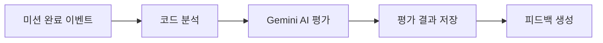
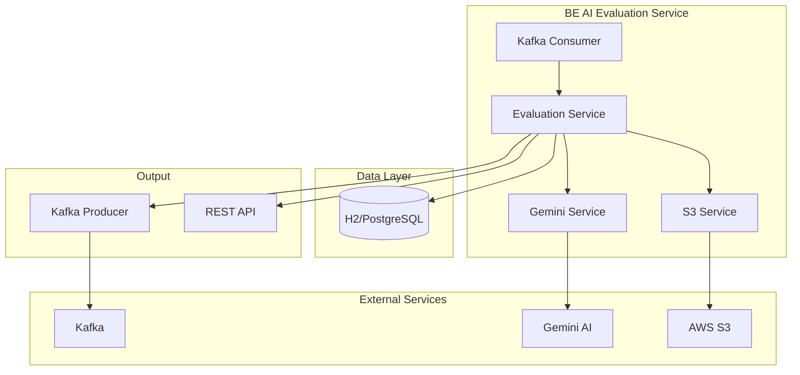

# BE AI 평가 서비스

DevOps 실습 결과를 AI로 자동 평가하는 백엔드 서비스입니다. Gemini AI를 사용하여 학습자의 코드와 실행 결과를 종합적으로 분석하고 피드백을 제공합니다.

## 📋 목차

- [개요](#개요)
- [주요 기능](#주요-기능)
- [시스템 아키텍처](#시스템-아키텍처)
- [기술 스택](#기술-스택)
- [설치 및 실행](#설치-및-실행)
- [API 문서](#api-문서)
- [배포](#배포)
- [모니터링](#모니터링)

## 🎯 개요

BE AI 평가 서비스는 DevTrip 플랫폼의 핵심 구성요소로, 학습자가 수행한 DevOps 미션의 결과를 자동으로 평가합니다.

### 주요 특징

- **AI 기반 코드 평가**: Gemini 2.5 Pro 모델을 활용한 지능형 코드 분석
- **실시간 이벤트 처리**: Kafka를 통한 비동기 미션 완료 이벤트 수신
- **종합적 분석**: 코드 품질, 보안성, 스타일, 리소스 효율성 등 다각도 평가
- **확장성**: Kubernetes 기반 마이크로서비스 아키텍처
- **안정성**: 재시도 로직, 에러 처리, 모니터링 내장

## 🚀 주요 기능

### 1. AI 코드 평가 엔진



- **정량적 평가**: correctness(1-5), efficiency(1-5), quality(1-5) 점수
- **정성적 피드백**: 구체적인 개선사항과 칭찬 포인트
- **핵심 명령어 분석**: kubectl, docker 등 DevOps 도구 사용법 평가
- **리소스 효율성**: CPU, 메모리, 네트워크 사용량 분석

### 2. 이벤트 기반 아키텍처

```java
@KafkaListener(topics = "#{@environment.getProperty('kafka.topic.mission-completed')}")
public void handleMissionCompleted(MissionCompletedEvent event) {
    evaluationService.processEvaluation(event);
}
```

- **Kafka 컨슈머**: 미션 완료 이벤트 실시간 수신
- **이벤트 발행**: 평가 완료 시 결과 이벤트 발행
- **비동기 처리**: 논블로킹 평가 프로세스

### 3. 평가 데이터 관리

#### 엔티티 구조
```java
@Entity
public class AIEvaluation {
    private String missionAttemptId;    // 고유 식별자
    private EvaluationStatus status;    // PENDING, PROCESSING, COMPLETED, FAILED
    private String evaluationResult;    // JSON 형태의 평가 결과
    private String aiModelVersion;      // 사용된 AI 모델 버전
}
```

#### 평가 상태 추적
- **중복 방지**: `missionAttemptId` 기반 중복 평가 차단
- **상태 이력**: 모든 상태 변경 이력 저장
- **에러 복구**: 실패한 평가의 재시도 지원

### 4. S3 데이터 통합

```java
public EvaluationResultDTO evaluateCode(
    String code, String missionType, String missionId,
    String missionObjective, List<String> checklist,
    String s3StorageUrl, String s3PreSignedUrl,
    SimpleStatistics statistics) {
    
    // S3에서 실행 로그 읽기
    String s3Data = mockS3DataService.readS3DataByPreSignedUrl(s3PreSignedUrl);
    
    // AI 평가 프롬프트 구성
    String prompt = buildEnhancedEvaluationPrompt(
        code, missionType, missionId, missionObjective, 
        checklist, s3StorageUrl, s3PreSignedUrl, statistics, s3Data);
        
    return callGeminiApi(prompt);
}
```

### 5. 안정성 및 에러 처리

#### Gemini API 재시도 로직
```java
for (int attempt = 1; attempt <= maxRetryAttempts; attempt++) {
    try {
        return restTemplate.exchange(url, HttpMethod.POST, request, String.class);
    } catch (ResourceAccessException e) {
        // 네트워크 오류 시 재시도
        if (attempt < maxRetryAttempts) {
            Thread.sleep(retryDelaySeconds * 1000L * attempt);
        }
    }
}
```

#### 구조화된 에러 처리
- **API 호출 실패**: 점진적 백오프와 함께 최대 3회 재시도
- **JSON 파싱 오류**: 다양한 응답 형식 지원 및 Fallback 결과 제공
- **S3 접근 오류**: 안전한 에러 처리로 평가 프로세스 지속
- **데이터베이스 오류**: 트랜잭션 단위 분리 및 부분 실패 허용

## 🏗️ 시스템 아키텍처



### 컴포넌트 역할

| 컴포넌트 | 역할 | 기술 스택 |
|----------|------|----------|
| **Kafka Consumer** | 미션 완료 이벤트 수신 | Spring Kafka |
| **Evaluation Service** | 평가 프로세스 총괄 관리 | Spring Boot |
| **Gemini Service** | AI 모델과의 통신 담당 | RestTemplate |
| **S3 Service** | 실행 로그 데이터 조회 | AWS SDK |
| **Database** | 평가 결과 및 이력 저장 | JPA/Hibernate |
| **REST API** | 외부 시스템 연동 인터페이스 | Spring Web |

## 💻 기술 스택

### Backend
- **Framework**: Spring Boot 3.2+
- **Language**: Java 17
- **Build Tool**: Gradle 8
- **Database**: H2 (개발), PostgreSQL (운영)
- **ORM**: JPA/Hibernate
- **Message Queue**: Apache Kafka

### AI & External APIs
- **AI Model**: Google Gemini 2.5 Flash Exp
- **Cloud Storage**: AWS S3
- **API Client**: RestTemplate

### Infrastructure
- **Container**: Docker
- **Orchestration**: Kubernetes
- **Package Manager**: Helm
- **CI/CD**: Jenkins
- **Monitoring**: Prometheus + Grafana

### Development
- **Code Quality**: SonarQube
- **Testing**: JUnit 5, Testcontainers
- **Documentation**: Swagger/OpenAPI 3

## 🔧 설치 및 실행

### 개발 환경 설정

1. **필수 요구사항**
   ```bash
   Java 17+
   Gradle 8+
   Docker & Docker Compose
   ```

2. **환경변수 설정**
   ```bash
   export GEMINI_API_KEY=your_gemini_api_key
   export AWS_ACCESS_KEY=your_aws_access_key  
   export AWS_SECRET_KEY=your_aws_secret_key
   ```

3. **의존 서비스 시작**
   ```bash
   docker-compose up -d kafka postgres
   ```

4. **애플리케이션 실행**
   ```bash
   ./gradlew bootRun
   ```

### Docker 실행
```bash
docker build -t be-ai-evaluation-service .
docker run -p 8084:8084 \
  -e GEMINI_API_KEY=${GEMINI_API_KEY} \
  -e AWS_ACCESS_KEY=${AWS_ACCESS_KEY} \
  -e AWS_SECRET_KEY=${AWS_SECRET_KEY} \
  be-ai-evaluation-service
```

## 📚 API 문서

### Swagger UI
- 개발 환경: http://localhost:8084/swagger-ui.html
- API 문서: http://localhost:8084/api-docs

### 주요 엔드포인트

#### 평가 결과 조회
```http
GET /api/evaluation/{missionAttemptId}
```

#### 평가 요약 목록
```http  
GET /api/evaluation/summary?userId={userId}&missionId={missionId}
```

#### 수동 평가 트리거 (테스트용)
```http
POST /api/evaluation/manual
Content-Type: application/json

{
  "missionAttemptId": "mission-123",
  "code": "kubectl apply -f deployment.yaml",
  "missionType": "kubernetes",
  "missionObjective": "Deploy application to K8s"
}
```

## 🚢 배포

### Helm 차트 배포

1. **네임스페이스 생성**
   ```bash
   kubectl create namespace devtrip
   ```

2. **시크릿 설정**
   ```bash
   kubectl create secret generic ai-evaluation-secrets \
     --from-literal=gemini-api-key=${GEMINI_API_KEY} \
     --from-literal=aws-access-key=${AWS_ACCESS_KEY} \
     --from-literal=aws-secret-key=${AWS_SECRET_KEY} \
     -n devtrip
   ```

3. **Helm 설치**
   ```bash
   helm upgrade --install ai-evaluation ./helm \
     --namespace devtrip \
     --set image.repository=your-registry/be-ai-evaluation-service \
     --set image.tag=latest
   ```

### Jenkins CI/CD

Jenkins 파이프라인이 자동으로 다음을 수행합니다:

```yaml
개발 브랜치 (develop):
  1. 코드 빌드 및 테스트
  2. Docker 이미지 빌드
  3. 개발 환경 자동 배포

메인 브랜치 (main):  
  1. 코드 빌드 및 테스트
  2. Docker 이미지 빌드
  3. 스테이징 환경 자동 배포
  4. 프로덕션 배포 승인 대기
```

## 📊 모니터링

### Health Check
```bash
curl http://localhost:8084/actuator/health
```

### 주요 메트릭
- **평가 처리 시간**: `evaluation.processing.time`
- **Gemini API 호출 성공률**: `gemini.api.success.rate`  
- **Kafka 메시지 처리량**: `kafka.message.throughput`
- **데이터베이스 연결 상태**: `database.connection.status`

### 로그 구조
```json
{
  "timestamp": "2025-01-19T10:30:00Z",
  "level": "INFO", 
  "missionAttemptId": "mission-123",
  "stage": "EVALUATION_COMPLETED",
  "processingTimeMs": 2500,
  "overallScore": 85,
  "message": "AI evaluation completed successfully"
}
```

## 🔧 설정

### 주요 설정 항목 (application.properties)

```properties
# 서버 설정
server.port=8084

# Gemini AI 설정  
gemini.api.retry.max-attempts=3
gemini.api.retry.delay-seconds=2
gemini.api.timeout.connect-seconds=30
gemini.api.timeout.read-seconds=120

# Kafka 설정
spring.kafka.bootstrap-servers=localhost:9092
kafka.topic.mission-completed=mission.completed
kafka.topic.evaluation-completed=evaluation.completed

# 데이터베이스 설정
spring.datasource.url=jdbc:h2:mem:testdb
spring.jpa.hibernate.ddl-auto=update

# 모니터링 설정
management.endpoints.web.exposure.include=health,info,metrics,prometheus
```

## 🤝 기여하기

1. Fork the repository
2. Create a feature branch: `git checkout -b feature/new-feature`
3. Commit your changes: `git commit -am 'Add new feature'`
4. Push to the branch: `git push origin feature/new-feature`
5. Submit a Pull Request

## 📄 라이센스

이 프로젝트는 MIT 라이센스 하에 배포됩니다. 자세한 내용은 [LICENSE](LICENSE) 파일을 참조하세요.

## 📞 연락처

- **개발팀**: devtrip-backend@example.com
- **이슈 리포트**: [GitHub Issues](https://github.com/devtrip-project/BE-AI-evaluation-service/issues)
- **문서**: [Wiki](https://github.com/devtrip-project/BE-AI-evaluation-service/wiki)